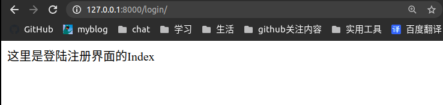
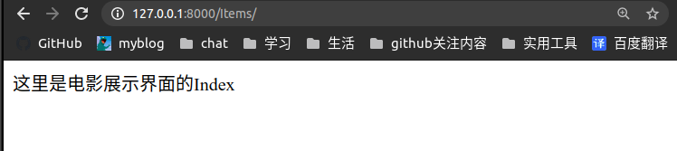
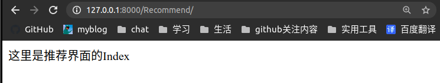

## 电影推荐系统

一个简易的电影推荐系统，包括用户注册登陆，展示电影信息，为我推荐电影，我的观影记录四个模块。

因为实现的时间大概也有十几天，所以大概率会是一个拼凑而成的怪物，大家尽力而为。

### 参考内容

* [https://github.com/JaniceWuo/MovieRecommend](https://github.com/JaniceWuo/MovieRecommend)
* [https://github.com/zhengyizoey/watchfilms_django_website](https://github.com/zhengyizoey/watchfilms_django_website)
* [刘江的Django教程](https://www.liujiangblog.com/)
* [官方文档](https://docs.djangoproject.com/zh-hans/3.0/)

### 数据来源

[https://www.csuldw.com/2019/09/08/2019-09-08-moviedata-10m/](https://www.csuldw.com/2019/09/08/2019-09-08-moviedata-10m/)

选择了其中1000部电影的数据，其中，还去掉了没有图片链接的电影。里面还有1G的电影数据，如果有兴趣可以进一步处理。

[https://grouplens.org/datasets/movielens/](https://grouplens.org/datasets/movielens/)

这里的数据更加全面，但是是json格式，暂时不会处理，先放下。

### 环境

* Ubuntu(推荐使用)
* Python3.7
* Django2.0
* mysql
* bootstrap

推荐使用anaconda，其中项目中所需要的库在`data/environment.yml`， 创建环境参考[Wlgls的博客]([https://wlgls.github.io/posts/Conda%E5%9F%BA%E6%9C%AC%E4%BD%BF%E7%94%A8#%E5%85%B1%E4%BA%AB%E7%8E%AF%E5%A2%83](https://wlgls.github.io/posts/Conda基本使用#共享环境))， 需要注意的是，在处理数据库时，推荐使用SQLAlchemy。

###  实现细节

#### 注册登陆界面

简易的注册登陆界面，分为注册和登陆两个部分，注册需要输入用户名和密码，注册登陆之后进入电影展示页面。

具体内容可随便参考

#### 电影展示界面

电影展示界面需要为电影提供图片，名称，简介，并且提供是否观看过按键。(忽略分类，仅提供简单的电影展示)

暂时不为电影评分，而是简单的看过与未看过两个选择。

具体的界面可参考[https://github.com/zhengyizoey/watchfilms_django_website](https://github.com/zhengyizoey/watchfilms_django_website)

#### 为我推荐界面

这一模块使用协同过滤算法为用户推荐电影。

提供简单的推荐按键

#### 我的观影清单

为用户展示被选择的观看过的电影。

### 实现过程

#### 2020年5月10日 -- 创建数据库

数据库使用mysql关系型数据库

约束(便于后期合并, 注意大小写):

* 在本地建立数据库时，数据库名请使用"MovieRecommend"

* 一共有三个表分别为"Users", "Movies", "Rating"。其表结构规定如下:

  | Users | UserID                | Username             | Password       |
  | :---- | --------------------- | -------------------- | -------------- |
  | eg    | 1                     | smith                | guazi          |
  | 说明  | 主键,自增,非空, INT型 | 唯一, 非空，字符串型 | 非空，字符串型 |

  | Movies | MovieID                 | MovieTitle     | Cover                                                        | StoryLine                                                    |
  | ------ | ----------------------- | -------------- | ------------------------------------------------------------ | ------------------------------------------------------------ |
  | eg     | 1                       | 太极           | https://img3.doubanio.com/view/photo/s_ratio_poster/public/p1833562883.jpg | 周星驰在片中饰演一名隐姓埋名的太极宗师，他移居美国在唐人街打工洗盘子，为了保护受暴徒威胁的同胞们，他挺身而出，此后创办了武术学校将他的一身好功夫传授给他人。 |
  | 说明   | 主键，自增，非空，INT型 | 非空，字符串性 | 字符串型(存储电影封面的链接，部分电影无封面，需要处理)       | 非空，字符串型                                               |

  | Rating | ID                      | UserID             | MovieID           |
  | ------ | ----------------------- | ------------------ | ----------------- |
  | eg     | 1                       | 1                  | 1                 |
  | 说明   | 主键，自赠，非空，INT型 | 外键，非空 , INT型 | 外键，非空，INT型 |

创建代码如data/file.sql， 可以自行运行其中的代码，或者运行以下命令(Ubuntu)

```
mysql -uusername -pusername >file.sql
```

如果你是使用root用户创建的数据库，请创建一个新的用户，使用这个新的用户来对database进行访问例如:

```
GRANT ALL PRIVILEGES ON MovieRecommend.* TO smith@"%" IDENTIFIED BY "smith"; 
```

#### 数据预处理

为了更加合适的实现项目，在数据库中首先存储一些数据，其中，数据来源在data/movies.csv。

处理数据的代码在csv2sql.py，注意其中数据库的信息自行更改。

### 2020年5月12日 -- 大体设计

我们创建三个Apps，这样尽量可以三个Apps并行开发互不干扰。其主要命令为:

```
$: python manage.py startapp login
$: python manage.py startapp Recommend
$: python manage.py startapp Items
```

​	添加并设置了urls.py, views等文件。具体内容可直接参考源码。

MovieRecommend/settings.py中设置数据库为mysql， 需要注意的是，请务必更改为自己的数据库信息：

```
DATABASES = {
    'default': {
        'ENGINE': 'django.db.backends.mysql',
        'NAME': 'MovieRecommend',
        'USER': 'smith',
        'PASSWORD': 'smith',
        'HOST': '127.0.0.1',
        'PORT': '3306',
    }
}
```

之后可以输入url来观察各个界面了。







现在，可以在各个App中开始做了。大家加油！

(需要注意的时候，你在设计models，需要与我所设计的数据库一致。

这是因为，当我们执行`python manage.py makemigrations`和`python manage.py migrate`会在数据库中创建表，这也就意味着，你可以在前面的数据库操作中仅创建相关的数据库，而对于表的创建可以交给django，如果你不想这么做，可以Google注释掉相关的代码。之后的数据处理仍旧可以使用csv2sql.py)

#### 工作方式

请直接克隆我的项目，并学习一点点git的格式，当你在设计时，请为自己创建一个单独的分支，而不是直接在master上进行操作提交。